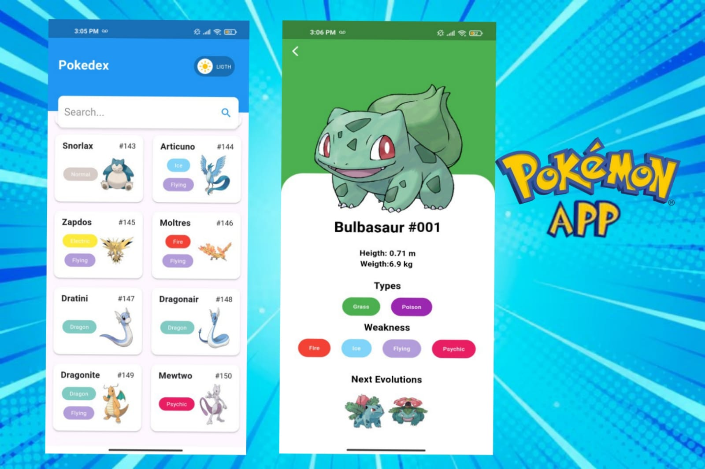

## Aplicación de Pokemon

  

### ¿Qué es esta app?

Es una proyecto personal con Flutter en el cual desarrolle una aplicación de busqueda de pokemons. El concepto de esta app es básicamente una pokedex. El usuario obtiene el pokemon que busca y sus caracteristicas. Así es como luce mi aplicación:

### Funcionalidades completadas

- buscador de pokemons

### Conceptos de Flutter aplicados

- Layout con múltiples hijos (Row y Column)
- Paquetes/librerías de terceros en Flutter
- Estados en Flutter (Stateless y Stateful)
- Separación de componentes en partes pequeñas
- Implementación de los 4 pilares de la Programación Orientada a Objetos
- Mejora del diseño de la interfaz de usuario (UI)
- Gestión de estado
